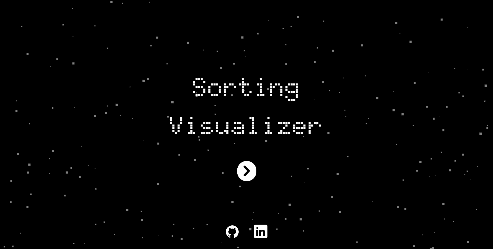

# Sorting Visualizer

Sorting Visualizer is an interactive web application built with React, TypeScript, and Redux to help users visualize how different sorting algorithms work. This project is perfect for students, educators, and anyone curious about understanding sorting algorithms in an intuitive and fun way.

---

## 🚀 Features

- 🎨 **Interactive Visualization**: Watch how the algorithms sort arrays step-by-step.
- ⚡ **Multiple Algorithms**: Includes popular sorting algorithms such as:
  - Bubble Sort
  - Selection Sort
  - Insertion Sort
  - Merge Sort
  - Quick Sort
- 🛠️ **Customizability**:
  - Adjust the array size.
  - Change the sorting speed.
  - Generate new random arrays.
  - Allow users to pause and resume visualization.
- 🔄 **State Management with Redux**: All app states, such as the array data, sorting speed, and algorithm selection, are managed centrally with Redux.
- 📚 **Educational Tool**: Perfect for learning the internal workings of sorting algorithms.

---

## 🛠️ Tech Stack

- **Frontend**: React (with TypeScript)
- **State Management**: Redux Toolkit
- **Styling**: Tailwind CSS 
- **Build Tool**: Vite 

---

## 📦 Installation

1. **Clone the repository**:
   ```bash
   git clone https://github.com/CodeBurnerrr/Sorting-Visualizer.git
   cd sorting-visualizer
   ```

2. **Install dependencies**:
   ```bash
   npm install
   ```

3. **Start the development server**:
   ```bash
   npm run dev
   ```

4. **Open the app**:
   Navigate to `http://localhost:5173` in your browser.

---

## 🔧 Usage

1. **Select an Algorithm**: Choose the sorting algorithm you want to visualize.
2. **Customize the Array**:
   - Adjust the size of the array using the slider.
   - Change the sorting speed.
3. **Start Visualization**: Click on the "Sort" button to watch the sorting process.
4. **Reset or Generate New Array**: Click on the "Generate Array" button to reset or create a new array.

---

## 🌟 Features Powered by Redux

- **Centralized State**: The array data, sorting algorithm, and speed are all managed globally for better performance and maintainability.
- **Real-time Updates**: Changes in controls instantly reflect in the visualization due to Redux state synchronization.
- **Extensibility**: Easily add new features by extending the Redux store.

---

## 📸 Screenshots

### Home Page


### Bubble Sort in Action


---

## 🚧 Future Enhancements

- Add more sorting algorithms (e.g., Heap Sort, Radix Sort).
- Display time and space complexity of each algorithm during visualization.
- Support for dark mode.
- Add responsive design for support across all devices

---

## 🤝 Contributing

Contributions are welcome! If you have suggestions or improvements, feel free to create an issue or submit a pull request.

---

## 📜 License

This project is licensed under the [MIT License](LICENSE).

---

## 🌟 Acknowledgements

- Inspired by various sorting visualizer projects available online.
- Built with ❤️, React TypeScript, and Redux.

